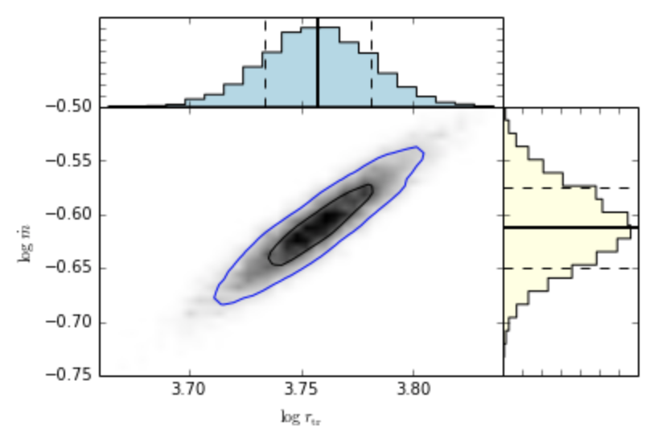

`nmmn` package
================

Tools for astronomy, data analysis, time series, numerical simulations, gamma-ray astronomy and more! These are modules I wrote which I find useful—for whatever reason—in my research.

List of submodules available ([more info here](http://rsnemmen.github.io/nmmn/)):

* `astro`: astronomy
* `dsp`: signal processing
* `lsd`: misc. operations on arrays, lists, dictionaries and sets
* `stats`: statistical methods
* `sed`: spectral energy distributions
* `plots`: custom plots
* `fermi`: Fermi LAT analysis methods
* `bayes`: Bayesian tools for dealing with posterior distributions
* `grmhd`: tools for dealing with GRMHD numerical simulations

Very basic [documentation](http://rsnemmen.github.io/nmmn/) for the modules.

# Installation

You have a couple of options to install the module:

1. Install using `pip`:

```
pip install nmmn
```


2. Install the module on the system’s python library path: 

```
python setup.py install
```

3. Install the package with a symlink, so that changes to the source files will be immediately available:

```
python setup.py develop
```

This last method is preferred to sync with changes in the repo. You may need to run the last command with `sudo`.

To upgrade the package to the latest stable version, try

    pip install --upgrade nmmn

if you installed with `pip`. If you installed with the `setup.py` script and the `develop` option, try

    cd /path/to/nmmn
    git pull

# Usage

Example 1: Remove all `nan` and `inf` elements from a `numpy` array.

```python
import nmmn.lsd, numpy
x=numpy.array([1,2,numpy.nan,numpy.inf])
xok=nmmn.lsd.delweird(x)
```

Example 2: Reads SED generated by [`grmonty`](https://github.com/rsnemmen/grmonty).

```python
import nmmn.sed
s=nmmn.sed.SED()
s.grmonty('grmonty.spec')
plot(s.lognu, s.ll)
```

Now it is easy to compute the bolometric luminosity: `s.bol()`.

Example 3: Make a 2D kernel density distribution plot, along with the 1D histograms.

```python
import nmmn.plots
# define your 1D arrays X and Y with the points
nmmn.plots.jointplot(X,Y,xlabel='$\log \ r_{\\rm tr}$', ylabel='$\log \ \dot{m}$')
```



Example 4: Use the colormap of Wolfram Mathematica for plotting images.

```python
import nmmn.plots
wolframcmap=nmmn.plots.wolframcmap()
# define var with the image
imshow(var, cmap=wolframcmap)
```


Note that there is also a method here for using MATLAB's parula colormap.

Example 5: Plot four histograms in the same figure.

```python
import nmmn.plots
# define your 4 variables x1, x2, x3 and x4 that will be plotted as histograms
nemmen.fourhists(x1,x2,x3,x4,-3,0,'BL Lacs','FSRQs','Blazars','GRBs','$\log \epsilon_{\\rm rad}$',fig=2,fontsize=15,bins1=15,bins2=15,bins3=15,bins4=15)
```


# TODO

* [x] need more examples of how to use the modules
* [ ] add IFU data cubes method

# License

See `LICENSE` file.

If you have suggestions of improvements, by all means please contribute with a pull request!  :)

The MIT License (MIT). Copyright (c) 2018 [Rodrigo Nemmen](http://rodrigonemmen.com)

[Visit the author's web page](http://rodrigonemmen.com/) and/or follow him on twitter ([@nemmen](https://twitter.com/nemmen)).