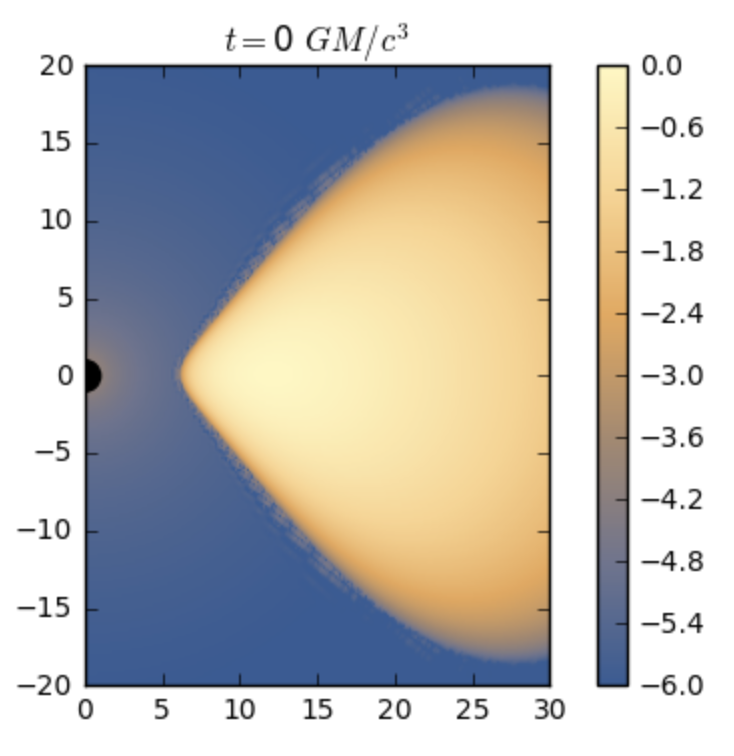
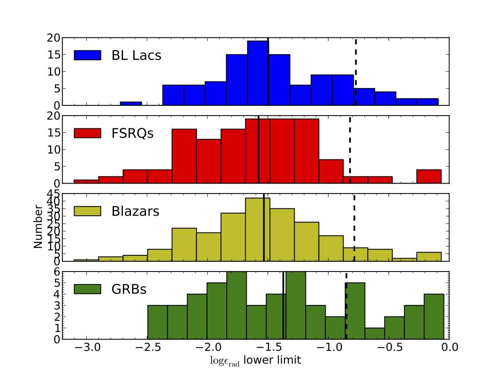

Examples: how to use the `nmmn` module
=====================================

# Array operations

Example 1: Remove all `nan` and `inf` elements from a `numpy` array.

```python
import nmmn.lsd, numpy
x=numpy.array([1,2,numpy.nan,numpy.inf])
xok=nmmn.lsd.delweird(x)
```

=> propagate errors

=> propagate complex error distributions (e.g. asymmetric error bars)


# Spectral energy distributions

Example 1: Reads SED generated by [`grmonty`](https://github.com/rsnemmen/grmonty).

```python
import nmmn.sed
s=nmmn.sed.SED()
s.grmonty('grmonty.spec')
plot(s.lognu, s.ll)
```

Now it is easy to compute the bolometric luminosity: `s.bol()`.

=> plot SED with pretty axis

# Plots

Example 1: Make a 2D kernel density distribution plot, along with the 1D histograms.

```python
import nmmn.plots
# define your 1D arrays X and Y with the points
nmmn.plots.jointplot(X,Y,xlabel='$\log \ r_{\\rm tr}$', ylabel='$\log \ \dot{m}$')
```


Example 2: Use the colormap of Wolfram Mathematica for plotting images.

```python
import nmmn.plots
wolframcmap=nmmn.plots.wolframcmap()
# define var with the image
imshow(var, cmap=wolframcmap)
```



Note that there is also a method here for using MATLAB's parula colormap.

Example 3: Plot four histograms in the same figure.

```python
import nmmn.plots
# define your 4 variables x1, x2, x3 and x4 that will be plotted as histograms
nemmen.fourhists(x1,x2,x3,x4,-3,0,'BL Lacs','FSRQs','Blazars','GRBs','$\log \epsilon_{\\rm rad}$',fig=2,fontsize=15,bins1=15,bins2=15,bins3=15,bins4=15)
```



=> plot linear fit with confidence band


# Statistics

Example 1: Given the Pearson correlation coefficient `r`, what is the p-value for the null hypothesis of no correlation?

```python
# let's say r was computed from arrays x,y
r=0.4

# compute p-value
p=nmmn.stats.r2p(r,x.size)

print(p)
```

Example 2: Given the p-value, what is statistical confidence for rejecting the null hypothesis, in standard deviations (i.e. in sigmas)?

    nmmn.stats.p2sig(p)
    
